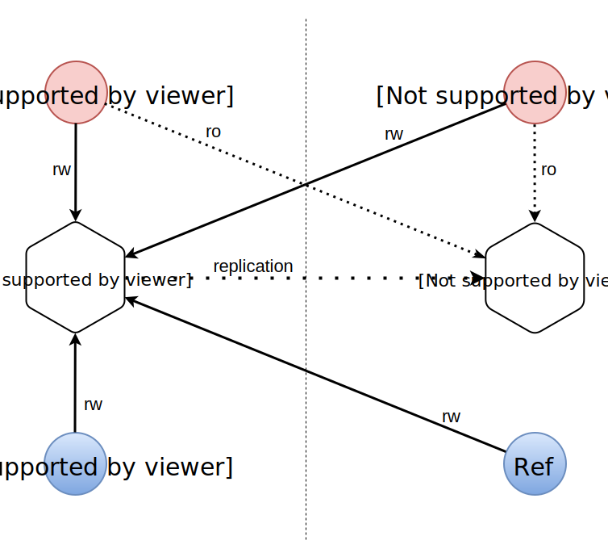
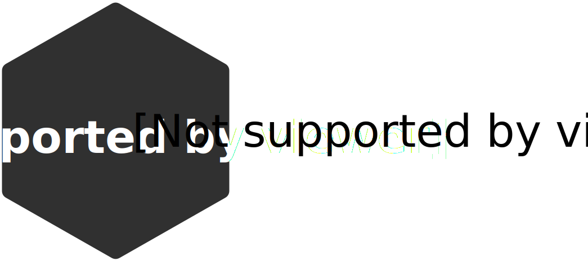
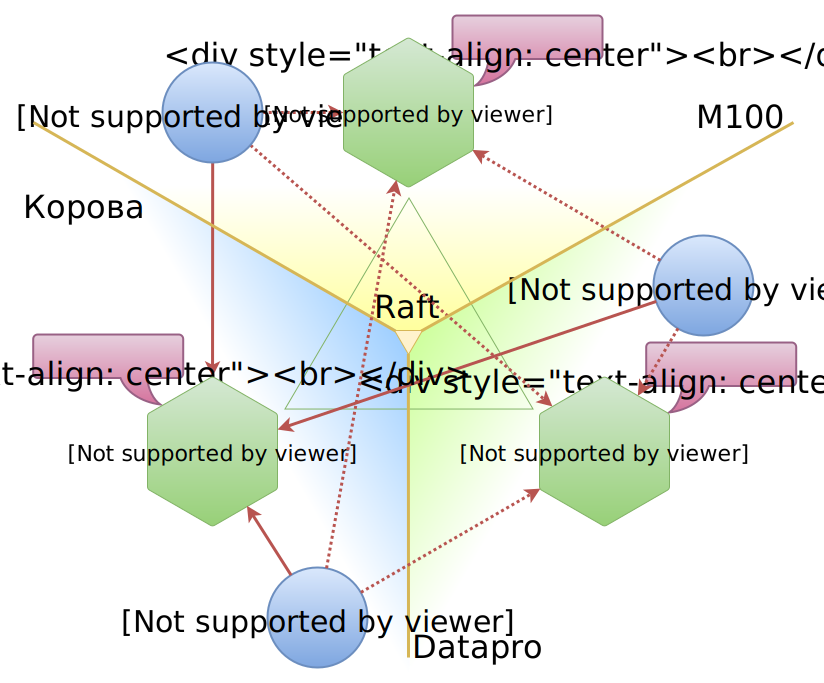

class:firstpage

# Отказоустойчивая обработка 10 миллионов<br> OAuth токенов на Tarantool 

### Mons Anderson<br>Игорь Латкин

---
layout: true
class: center, middle

---

# супер-оптимальность и производительность

# дисковое хранилище - винил

# json документы


---

# Что ещё&hellip;

---

class: h-margin, center, middle

.right[

]

## Get your<br> data in RAM
## .red[Compute<br> close to data]
## Enjoy the<br> performance

---
layout: false

# О чём мы будем рассказывать?

--

## Оглянемся назад: что было 3 года назад?

--

## Какие проблемы были?

--

## Master ⟷ Master репликация

--

## В поисках Raft'а

--

## Объединяем Raft и шардинг

--

## Оцениваем результат

---
class: image-text

.txt[
# &nbsp;2013 г.
## первая схема

## классика (M-S)

]
.svg[

]
---

# Зачем?

## Сборщики почты
## Вход внешней почтой
## Хранение адресных книг
## Выдача действующего access_token

---

# Что такое OAuth токен?
.big[
```json
{
    "token_type"    : "bearer",
    "access_token"  : "XXXXXX",
    "refresh_token" : "YYYYYY",
    "expires_in"    : "3600"
}
```
]

---

# Что такое OAuth токен?
.big[
```json
{
    "token_type"    : "bearer",
    "access_token"  : "XXXXXX",
    "refresh_token" : "YYYYYY",
*   "expires_in"    : "3600"
}
```
]

---

# Проблемы?

--

## 25% Outage за 15 минут 
## 50% Outage за 30 минут 
## 100% Outage за 1 час

--

## &nbsp;

## 2015 г. - 100% CPU (много бизнес-логики и индексов) 
## Вторичная логика влияет на основную задачу

---
class: image

.svg[

]

---
class:center, middle

# ⓘ

# 3 датацентра 
# 3 копии
# MM - репликация 

---
class: image-text

.txt[
# Sidenote
]
.svg[

]

---
class: h-margin, center, middle

.right[

]

## Get your<br> data in RAM
## .red[Compute<br> close to data]
## Enjoy the<br> performance

---

.right[
## [tarantool.org](http://tarantool.org/doc)
]
.left[
## Documentation:
]
.right[
##[try.tarantool.org](http://tarantool.org/doc)
]
.left[
## Try it online: 
]

.right[
##[github.com/tarantool](http://github.com/tarantool)
]
.left[
## Explore it: 
]

.right[
##[github.com/mons/tnt-luas](http://github.com/mons/tnt-luas)
]
.left[
## Luas: 
]

.smallimg[

]

.lastquote[
### Questions?
]
