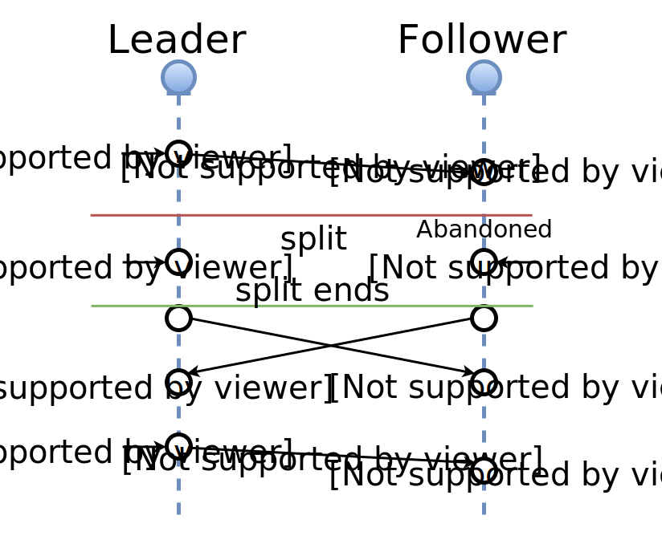

class:firstpage

# Отказоустойчивая обработка 10 миллионов<br> OAuth токенов на Tarantool 

### Mons Anderson<br>Игорь Латкин

---
layout: true
class: center, middle

---

# супероптимальность и производительность

# дисковое хранилище - vinyl

# json документы


---

# Что ещё&hellip;


---
class: center, middle

<table width="100%" border="0">
    <tr>
        <td><h2>Get your<br>data in RAM</h2></td>
        <td rowspan="3" width="45%"></td>
    </tr>
    <tr>
        <td><h2 style="color:red">Compute<br>close to data</h2></td>
    </tr>
    <tr>
        <td><h2>Enjoy the<br>performance</h2></td>
    </tr>
</table>

---
layout: false

# О чём мы будем рассказывать?

--

## Оглянемся назад: что было 3 года назад?

--

## Какие проблемы были?

--

## Master ⟷ Master репликация

--

## В поисках Raft'а

--

## Объединяем Raft и шардинг

--

## Оцениваем результат

---

# Зачем?

## Сборщики почты
## Вход внешней почтой
## Хранение адресных книг
## Выдача действующего access_token

---

# Что такое OAuth токен?
.big[
```json
{
    "token_type"    : "bearer",
    "access_token"  : "XXXXXX",
    "refresh_token" : "YYYYYY",
    "expires_in"    :  3600
}
```
]

---
class: image-text

.txt[
# &nbsp;2013 г.
## первая схема

## классика (M-S)

]
.svg[

]

---

# Что такое OAuth токен?
.big[
```json
{
    "token_type"    : "bearer",
    "access_token"  : "XXXXXX",
    "refresh_token" : "YYYYYY",
*   "expires_in"    :  3600
}
```
]


---

# Проблемы?

--

## 25% Outage за 15 минут 
## 50% Outage за 30 минут 
## 100% Outage за 1 час

--

## &nbsp;

## 2015 г. - 100% CPU (много бизнес-логики и индексов) 
## Вторичная логика влияет на основную задачу

---
class: center,middle,image

.svg[

]

---
class:center, middle

# ⓘ

# 3 датацентра 
# 3 копии
# MM - репликация

---
class: image-text

.svg[

]

--

.txt-center[
# в 3 раза больше запросов

# нужен выбор лидера
]

---


# Paxos ?

--

.center[

]

---
class:center, middle

# Raft!

---
class: image-text

.svg[

]

--

.txt[
```lua
require 'net.box'

--[[
  tarantool
  to tarantool
  connector
]]
```
]

---
class: image-text

.svg[

]

.txt-center[
# реализуем только выбор лидера
]

---

# Raft Leader Election (on lua)

```lua
local r = self.pool.call(self.FUNC.request_vote, self.term, self.uuid)
self._vote_count = self:count_votes(r)

if self._vote_count > self._nodes_count / 2 then
    log.info("[raft-srv] node %d won elections", self.id)
    self:_set_state(self.S.LEADER)
    self:_set_leader({ id=self.id, uuid=self.uuid })
    self._vote_count = 0
    self:stop_election_timer()
    self:start_heartbeater()
else
    log.info("[raft-srv] node %d lost elections", self.id)
    self:_set_state(self.S.IDLE)
    self:_set_leader(msgpack.NULL)
    self._vote_count = 0
    self:start_election_timer()
end
```

---
class: image-text

.svg[

]

---
class: image-text

.svg[

]

.txt-center[
# только лидер раздаёт задачи
# x 1 запросов
]

---
class: image-text

.svg[

]

.txt-center[
## случился split

## две ноды ok, одна оторвана
]

---
class: image-text, mm1

.svg[]

.txt-center[
## M-M реплицирует все изменения
]

--

.txt-center[

## консистентность?
]

---

# OAuth Token

.svg[

]

---
class: image-text

.svg[

]

.txt-center[
# refresher работает и с _leader_ и с _abandoned_
]

---
class: twocol, center

# Доступность

.l.center[
# Обычно

## связанных нод

# N/2 + 1

## запросов max

# 1x 
]

--

.r.center[
# У нас

## связанных нод 

# 1

## запросов max

# Nx
]

---
class: twocol, center

# Осталась ещё одна проблема

.l.center[
.box[
# 100% CPU
]
]
--
.r.center[
.box[
# Sharding!
]
]
.clear[]
--

## Кто знает что такое шардинг?

--

## Кто делал свой шардинг?

---
class:center, middle

.img100[

]

---
class:center, middle

.img100[

]

---
class:center, middle

.img100[

]

---
class:center, middle

.img100[

]

---
class:center, middle

.img100[

]

---
class:center, middle

.img100[

]

---
class:center, middle

# А не много 
# ли соединений?

---
class:center, middle

# Проблема Full mesh:

# N<sup>2</sup> соединений 
## N × (N-1)

---
class:center,middle

.img100[

]

---
class:center, middle

# N × const
## const = p + n - 1

### (n = 3, p = 3)

---
class:center,cluster

# MM + Raft + Shard + Proxy = Cluster

.img100[

]

---
class:center,middle

.img100[

]

---
class:center,middle

.img100[

]

---
class:center

.img100[

]

---

# queue:put

```lua
function put(data)
    local t = box.space.queue:auto_increment({
        'r',          --[[ status ]]
        util.time(),  --[[ time ]]
        data          --[[ any payload ]]
    })
    
    return t
end
```

---

# queue:take

```lua
function take(timeout)
    local start_time = util.time()
    local q_ind = box.space.tokens.index.queue
    local _,t

    while true do
        local it = util.iter(q_ind, {'r'}, { iterator = box.index.GE })
        _,t = it()
        if t and t[F.tokens.status] ~= 't' then
            break
        end
        
        local left = (start_time + timeout) - util.time()
        if left <= 0 then return end
        t = q:wait(left)
        if t then break end
    end
    t = q:taken(t)
    return t
end
```

---

# queue:taken

```lua
function queue:taken(task)
    local sid = box.session.id()
    if self._consumers[sid] == nil then
        self._consumers[sid] = {}
    end
    local k = task[self.f_id]
    local t = self:set_status(k, 't')
    
    self._consumers[sid][k] = { util.time(), box.session.peer(sid), t }
    self._taken[k] = sid
    return t
end
```

---

# queue:on_disconnect

```lua
function on_disconnect()
    local sid = box.session.id
    local now = util.time()

    if self._consumers[sid] then
        local consumers = self._consumers[sid]
        for k,rec in pairs(consumers) do
            time, peer, task = unpack(rec)

            local v = box.space[self.space].index[self.index_primary]:get({k})

            if v and v[self.f_status] == 't' then
                v = self:release(v[self.f_id])
            end
        end
        self._consumers[sid] = nil
    end
end
```


---
class:center,middle

.img100[

]

---

# Итог

## Проблема outage решена
## Горизонтальное масштабирование
## Проблема N<sup>2</sup> сведена к N×const
## Релизована логика на очереди под бизнес-задачу

---
class: center, middle

# Получено очень много опыта при написании собственной реализации Raft

---
class: center, middle

<table width="100%" border="0">
    <tr>
        <td><h2>Get your<br>data in RAM</h2></td>
        <td rowspan="3" width="45%"></td>
    </tr>
    <tr>
        <td><h2 style="color:red">Compute<br>close to data</h2></td>
    </tr>
    <tr>
        <td><h2>Enjoy the<br>performance</h2></td>
    </tr>
</table>

---

.right[
## [tarantool.org](http://tarantool.org/doc)
]
.left[
## Documentation:
]
.clear[]
.right[
##[try.tarantool.org](http://tarantool.org/doc)
]
.left[
## Try it online: 
]
.clear[]

.right[
##[github.com/tarantool](http://github.com/tarantool)
]
.left[
## Explore it: 
]
.clear[]

.smallimg[

]

.lastquote[
### Questions?
]
